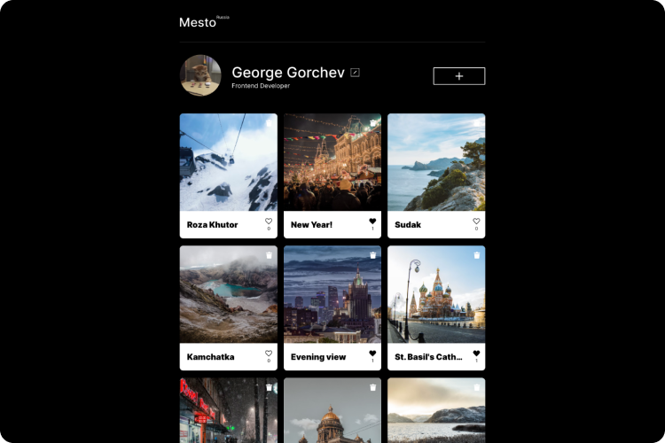

# Mesto

<p align="center" width="100%">
    <a href="https://geogeorgeous.github.io/mesto/)"></a><br>
       🚀 <a href="https://geogeorgeous.github.io/mesto/">View Live</a> | <i>Images by <a href="https://unsplash.com/license ">Unsplash</a></i>
</p>


### About the project
**Mesto** is my first Javascript application built for educational purposes while studying at [Practicum by Yandex](https://praktikum.yandex.ru/). 

Users can change the name, profile description and profile image, as well as publish their own cards with images of places. Unnecessary cards can always be deleted, and the most beautiful ones can be liked.

### Features
- **Like** others' cards and **upload** your own
- **Change account data:** username, description and profile image
- **Delete** cards you don't like (only your own)
- **Fullscreen mode:** open any card in full-screen mode by clicking on the image. 
- **Server storage:** cards' and users' data is stored on the REST-API server and won’t be deleted on page refresh.
- **Form live validation:** errors will alert you if you enter something wrong in the input field, and will prohibit the form submitting.
- **Adaptive and responsive:** The layout is displayed properly on any screens: from mobile to widescreen.
- **Error handling:** If there are problems with the server, the corresponding errors are displayed in the console.
- **Confirmation popups:** confirm the card deletion to avoid accidents

### Built With
  - JavaScript (ES6)
    - Asynchronous programming: Callbacks, Promises, fetch and Async / Await
    - Object-oriented programming: using classes and following the basic concepts: encapsulation, abstraction, inheritance and polymorphism
  - HTML & CSS
    - Semantic and valid layout
    - Grid and Flexbox
    - Adaptive and responsive
    - [BEM](https://en.bem.info/) ([BEM Nested](https://en.bem.info/methodology/filestructure/#nested))
  - [Webpack 4](https://webpack.js.org/)
    - [Babel](https://babeljs.io/)
    - [PostCSS](https://postcss.org/)
    - [autoprefixer](https://github.com/postcss/autoprefixer)
    - [cssnano](https://github.com/cssnano/cssnano)
    - [css-loader](https://webpack.js.org/loaders/css-loader/)
    - [mini-css-extract-plugin](https://webpack.js.org/plugins/mini-css-extract-plugin/)
    - [HtmlWebpackPlugin](https://github.com/jantimon/html-webpack-plugin)


  - Git

### Roadmap
- [ ] Migrate to Webpack 5
- [ ] Add English version

### Installation

Clone the repo
   ```sh
   git clone https://github.com/GeoGeorgeous/russian-travel.git
   ```

